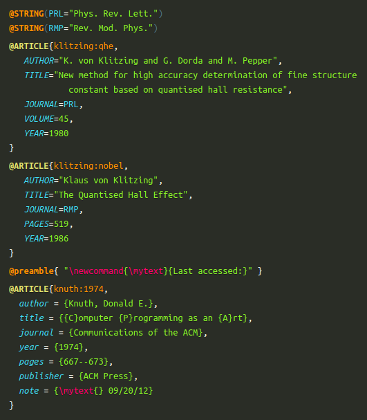

[PrismJS] is great! The minified core is less than 6&thinsp;KB, the API is gorgeous,
and although it uses simple regex matching, it is surprisingly accurate in most cases.
However, although it officially supports 175 languages currently, there is no support for [BibTeX] &#x1f612; ...

So here is a BibTeX language extension for PrismJS! &#x1f601;
<br>
Thanks to the fantastic extension support in PrismJS,
it took me less than an hour and only about 60 lines to write the initial version.
The minified JS file is less than 1.5&thinsp;KB and all you need to do to highlight those BibTeX snippets,
is just load it after `prism.js`.


<p align="center">
    
</p>


## &raquo; Examples

- Check out some basic BibTeX examples [on our webpage](https://saswatpadhi.github.io/prismjs-bibtex/)
- Or, the significantly larger (144&thinsp;KB) [ACM Turing Awards bibliography](https://saswatpadhi.github.io/prismjs-bibtex/acm-turing-awards.html)
- Or, the even bigger (534&thinsp;KB) [STOC 2010 -- 2019 bibliography](https://saswatpadhi.github.io/prismjs-bibtex/stoc_2010-2019.html) that contains abstracts of the papers (with `$...$` math)


## &raquo; Basic Usage

Using this extension is super simple --- just import `prism-bibtex.min.js` in the `head` of your HTML page.
For example:

```html
<link href="https://cdnjs.cloudflare.com/ajax/libs/prism/1.15.0/themes/prism-solarizedlight.min.css"/>
<script defer src="https://cdnjs.cloudflare.com/ajax/libs/prism/1.15.0/prism.min.js"></script>
<script defer src="https://saswatpadhi.github.io/prismjs-bibtex/prism-bibtex.min.js"></script>
```

The `defer` attribute delays the script execution (but not download) until the HTML page has been parsed completely.


## &raquo; Usage with Node

Install the package using `npm install prismjs-biblatex`.


[BibTeX]:   http://www.bibtex.org/
[prismjs]:  https://prismjs.com/