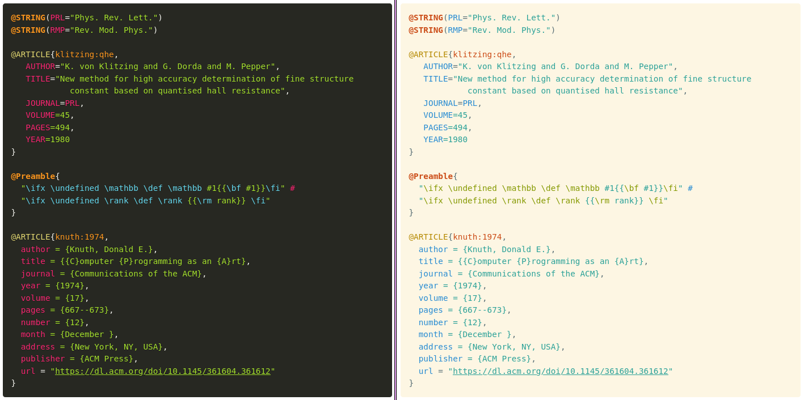

PrismJS-BibTeX
========

[](https://www.npmjs.com/package/prismjs-bibtex)

<a href="https://libraries.io/npm/prismjs-bibtex"></a> <a href="https://snyk.io/advisor/npm-package/prismjs-bibtex"></a>

A [BibTeX] language extension for [PrismJS].

<p align="center">
    
</p>

## Usage

### In HTML

Simply import the `prism-bibtex.min.js` (recommended at the end of `body`):

```html
<script src="https://cdn.jsdelivr.net/npm/prismjs-bibtex@2.1.0/prism-bibtex.min.js">
</script>
```

I recommend using the [SRI (Subresource Integrity)][SRI] hash as well:
```html
<script src="https://cdn.jsdelivr.net/npm/prismjs-bibtex@2.1.0/prism-bibtex.js"
        integrity="sha256-A5GMUmGHpY8mVpfcaRLQFeHtmdjZLumKBOMpf81FXX0="
        crossorigin="anonymous" referrerpolicy="no-referrer">
</script>
```

Remember to import the PrismJS stylesheets and scripts **before** importing this extension.
For example:

```html
<link rel="stylesheet" href="https://cdnjs.cloudflare.com/ajax/libs/prism/1.29.0/themes/prism-solarizedlight.min.css"/>
<script src="https://cdnjs.cloudflare.com/ajax/libs/prism/1.29.0/prism.min.js">
</script>
<script src="https://cdn.jsdelivr.net/npm/prismjs-bibtex@2.1.0/prism-bibtex.min.js">
</script>
```

### In NodeJS

1. Add the package to your project:

    ```console
    $ npm install prismjs-bibtex
    ```

2. Import `prismjs-bibtex` your .js file, after Prism:

    ```js
    import Prism from 'prismjs';
    import 'prismjs-bibtex';
    ```


## Examples

Check out some small BibTeX examples [on the project webpage](https://saswatpadhi.github.io/prismjs-bibtex/). You can also check the performance on large real-life `.bib` files below:
- (~68&thinsp;KB) [Some BibTeX examples from CTAN](https://saswatpadhi.github.io/prismjs-bibtex/biblatex-examples.html)
- (~144&thinsp;KB) [Bibliography of ACM Turing Award lectures](https://saswatpadhi.github.io/prismjs-bibtex/acm-turing-awards.html)
- (~534&thinsp;KB) [STOC 2010 -- 2019 bibliography](https://saswatpadhi.github.io/prismjs-bibtex/stoc_2010-2019.html)


[BibTeX]:   http://www.bibtex.org/
[prismjs]:  https://prismjs.com/
[SRI]:      https://developer.mozilla.org/en-US/docs/Web/Security/Subresource_Integrity